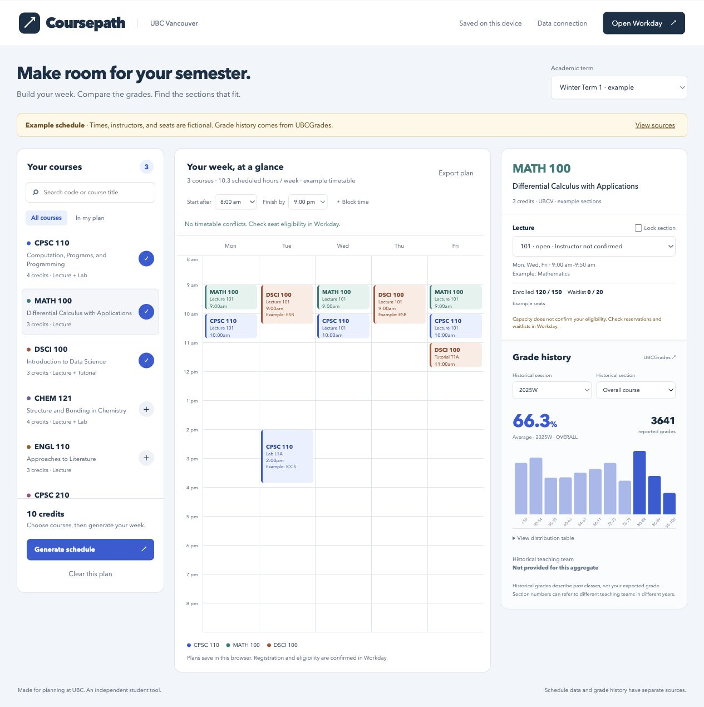

# Coursepath — UBC Vancouver course planner

A working local website that combines timetable generation with real UBCGrades distributions. Built with browser JavaScript and a Node.js server; no package installation is required.

**Current status:** historical grades are connected and verified. No approved schedule-and-seat feed is connected. Default schedules, instructor placeholders, locations, and seat counts are fictional examples and explicitly labelled throughout. The five-minute live-seat milestone is **not yet demonstrated**.

A read-only probe identified UBCScheduler's functioning section endpoint. The tested response lacked seat counts, observation times, academic-year identification, and pairing rules. [Read the findings](docs/data-access-findings.md); endpoint availability does not resolve those gaps or establish reuse permission.

## Preview



## Run

Requires Node.js 22.9 or newer.

```sh
npm start
```

Open <http://127.0.0.1:4317>. Use `PORT` to change the port. The server binds to loopback for local use. To stop it, press Ctrl+C.

```sh
npm test
```

## Features

- Search available courses by code or title; keep a course shortlist for each academic term.
- Generate compatible lecture/lab/tutorial combinations, respect linked sections, lock sections, block days/times, and choose earliest/latest class times.
- Revalidate existing plans when the course feed changes. Missing courses, cancelled sections, unknown meeting times, and conflicting preferences surface explicit errors.
- View real historical grade distributions, sample sizes, and teaching teams by academic session and historical section. Full course suffixes, campus, and historical session are matched exactly.
- Display enrollment/capacity and waitlisted/waitlist capacity separately from reservation notes and source observation times. Never infer personal eligibility from capacity.
- Save locally in the browser without an account; export a JSON planning record; open Workday to register.
- Responsive desktop/mobile layout, keyboard focus indicators, modal dialogs, and accessible grade tables.

The first demo visit generates a three-course example. Removing the example courses or clearing the plan persists your own choices. Changing academic term keeps separate saved plans. Plans are scoped to source and mode so demo choices are not reused for a real feed.

## Connect an approved schedule feed

1. Resolve access and redistribution/caching permissions with the provider using [the prepared inquiries](docs/access-inquiries.md).
2. Map the approved provider response to [the shared feed contract](docs/feed-contract.md). An adapter is needed once the actual provider format is known; no undocumented UBC endpoint is assumed.
3. Copy `.env.example` to `.env`, set `COURSE_FEED_URL` to the HTTPS endpoint, and set `COURSE_FEED_APPROVED=true` only after permission is confirmed. Optionally set the server-only `COURSE_FEED_TOKEN`. Restart the server.
4. Run the feed verification command and complete the Workday comparisons in [the validation report](docs/validation-report.md).

```sh
npm run verify:feed -- --samples 3 --interval-seconds 60 --output feed-report.json
```

The server refreshes the feed every 60 seconds by default. `FEED_REFRESH_SECONDS` sets the interval, with a minimum of 30 seconds. A successful fetch never changes `sourceObservedAt`. A section is current only when the source observation is at most five minutes old and not in the future. Missing timestamps show “Freshness unknown”; old timestamps show “Out of date.” Browser labels update as timestamps age. The refresh interval must be reconciled with the provider’s freshness and request limits.

When a configured feed fails, the last validated snapshot is retained with an error. If none exists, the site reports unavailable data; it never replaces an approved feed with demo data. The snapshot is in server memory; restarting during an outage loses that snapshot.

## Grade connection

The server uses <https://ubcgrades.com/api/v3/grades/UBCV/{session}/{subject}/{code}> and discovers historical sessions from <https://ubcgrades.com/api/v3/yearsessions/UBCV>. This endpoint requires **no trailing slash** in the verified deployment.

Lookups are cached in memory for one day, duplicate requests are coalesced, and at most three upstream requests run simultaneously. A 404 means no published history, not a synthesized estimate. Provider failures display a retry state or a clearly labelled previously retrieved snapshot. Real snapshots covering seven courses in 2024W and 2025W are bundled with their source URLs and exact retrieval times. Refresh them deliberately with `node scripts/capture-grades.js`.

No Workday credentials, personal registration data, or saved schedules are collected. Historical instructor names are public data from UBCGrades. Current instructors appear only when supplied by the course provider.

## API

| Route | Purpose |
|---|---|
| `GET /api/courses?term={termId}` | Normalized term, offered courses, sections, source, mode, retrieval time, and refresh error |
| `GET /api/grade-sessions` | Available historical sessions; labelled fallback if discovery is unavailable |
| `GET /api/grades?subject=MATH&code=100&session=2025W` | Exact course/session reports, source URL, retrieval time, and cached-fallback status |

Semester identifiers for current schedules are intentionally separate from UBCGrades yearsessions. A current section label is never automatically matched to a past instructor or past section.

## Implementation notes

The solver runs in a browser worker and is capped at 200,000 explored states. If that budget is exhausted it asks for narrower choices; it never returns an incomplete plan. Full/waitlisted sections can be included for planning; cancelled sections and sections with unpublished times are excluded unless explicitly asynchronous. Exported plans do not enroll the student.

This is a local MVP. External hosting, account synchronization, alerts, personalized eligibility, production load testing, and institutional integration remain outside the delivered local app. Production release requires a confirmed provider, deployment configuration, and the outstanding acceptance checks.
